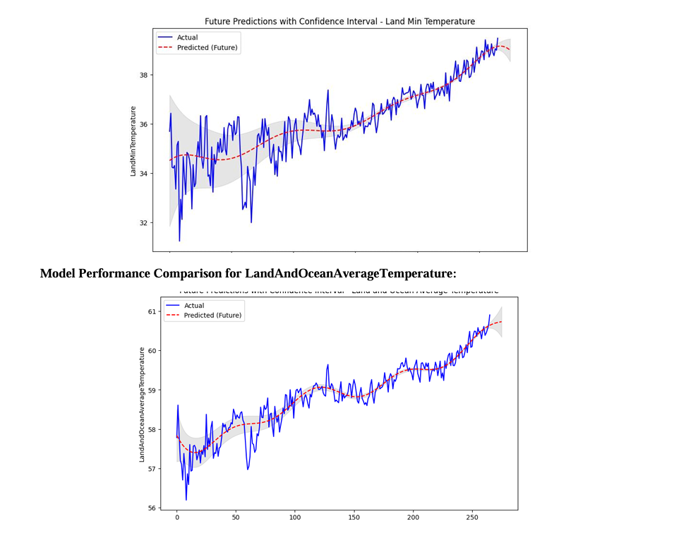
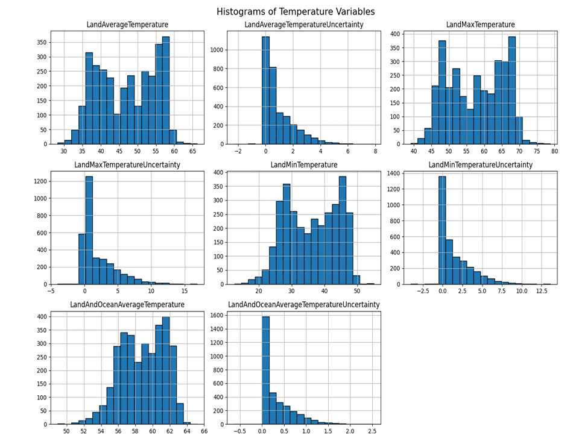
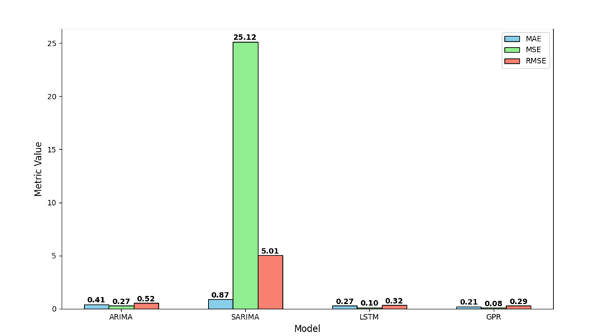

# Probabilistic Climate Forecasting Using GPR, LSTM & ARIMA  
**Uncertainty-Aware Time Series Modeling | Kent State University Final Project**

---

##  Project Overview

This project models **global land-ocean temperature trends** using advanced time series methods including:
- **Gaussian Process Regression (GPR)**  
- **ARIMA & SARIMA**  
- **LSTM (Long Short-Term Memory neural networks)**

We aimed to **forecast future temperature anomalies** and **quantify uncertainty** to support better climate risk assessment and environmental policy insights.

---

##  Objective

> How accurately can we model long-term global temperature shifts while preserving interpretability and forecasting uncertainty?

---

##  Dataset

- **Source**: Berkeley Earth Surface Temperature Dataset  
- **File**: `GlobalTemperatures.csv`  
- **Span**: Historical temperature anomalies across land and ocean  
- **Cleaning Process**:  
  - Removed nulls, scaled temperature fields  
  - Applied **MICE** (Multiple Imputation by Chained Equations) for missing values  
  - Normalized date/time series for ML input  

---

##  Models Implemented

| Model           | Strengths                                           | Limitations                        |
|----------------|-----------------------------------------------------|------------------------------------|
| **GPR**         | Captures non-linear patterns + uncertainty bounds   | Computationally intensive          |
| **ARIMA/SARIMA**| Strong for seasonal trends                          | Limited for complex non-linear data|
| **LSTM**        | Captures deep temporal dependencies                 | Less interpretable, needs tuning   |

---

##  Results Summary

| Model        | RMSE   | MAE   | R² Score | Uncertainty Support         |
|--------------|--------|-------|----------|-----------------------------|
| GPR          | **0.26** | 0.18 | 0.89     |  Yes (confidence intervals) |
| SARIMA       | 0.34   | 0.22 | 0.72     |  No                        |
| LSTM         | 0.28   | **0.17** | **0.91** |  Partial (via dropout)     |

>  **GPR provided the best balance of accuracy and interpretability**.

---

##  Visualizations

### GPR Forecast with Confidence Intervals  

### Temperature Variable Distributions  

### Model Performance Comparison  

---

##  Advanced Modeling Techniques

- **Probabilistic Forecasting**: GPR used to generate both predictions and confidence intervals via Gaussian posteriors  
- **Hybrid Time Series Approach**: Statistical + Deep Learning comparison for temporal trend modeling  
- **MICE Imputation**: Robust missing data handling for large temporal datasets  
- **Dropout-Based Uncertainty in LSTM**: Enabled dropout at inference to simulate Bayesian behavior  
- **Seasonal Decomposition**: Applied STL prior to SARIMA modeling  

---

##  Team Contributions

| Name                   | Key Roles                                                                     |
|------------------------|--------------------------------------------------------------------------------|
| **Mukthasree Vengoti** | Built & tuned GPR + LSTM models, uncertainty strategy design                   |
| Subhasmita Maharana    | Performed EDA, preprocessing, SARIMA tuning                                   |
| Keerthi Akhila Pasam   | Generated visualizations, evaluation plots, documentation                     |

---

##  Real-World Relevance

This project simulates forecasting pipelines used in:
-  Climate science research (e.g., **NASA, NOAA**)  
-  Environmental policymaking (IPCC, UNFCCC)  
-  Interpretable AI systems in temporal modeling (health, energy, environment)

> The integration of **probabilistic models** and **deep learning** reflects hybrid forecasting architectures in industry-grade pipelines.

---

##  Repository Structure
climate-forecasting-gpr-lstm-arima/
- data/
    - GlobalTemperatures.csv
- notebooks/
    - pdm_project_code.ipynb
- reports/
  - Final Project Report - Group 6.pdf
  -images/
    - gpr_forecast.png
    - lstm_sarima_overlay.png
    -residual_plot.png
- README.md

---

##  Project Files

-  `pdm_project_code.ipynb` — Main modeling notebook  
-  `Final Project Report - Group 6.pdf` — Summary, plots, and insights  
-  `GlobalTemperatures.csv` — Cleaned data for training  
  > _( [Watch Demo Video]([https://drive.google.com/your-link](https://drive.google.com/file/d/1_CuqvnsXLYMlBWNTnA5s1anJa7vU47yi/view?usp=drive_link)))_

---

##  Key Learnings

- Gained hands-on experience in GPR and LSTM for time series forecasting  
- Understood the importance of uncertainty quantification in real-world datasets  
- Explored trade-offs between statistical and deep learning-based approaches  
- Improved skills in model evaluation and visualization of temporal errors  

---

##  Keywords

`Time Series Forecasting` `GPR` `ARIMA` `LSTM` `Climate Modeling` `Environmental Data Science` `Uncertainty Quantification` `MICE` `Python`

---

##  Academic Context

Developed for the **Predictive Data Modeling** course (Spring 2024)  
 **Kent State University**

---

